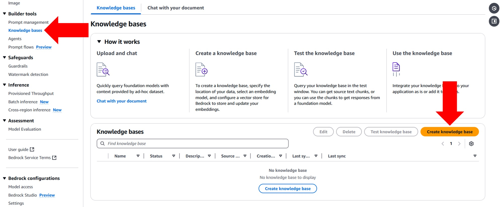
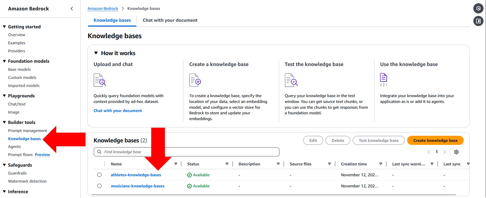
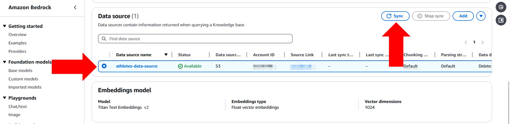

# Setting Up Knowledge Bases on AWS Bedrock with Amazon S3

## Overview
In AWS Bedrock, **Knowledge Bases** form the foundation for implementing **Retrieval-Augmented Generation (RAG)**. RAG combines large language models (LLMs) with a document retrieval system, enabling dynamic and contextualized responses by retrieving relevant documents from a knowledge base and using them to enhance model-generated responses. This document guides you through creating and managing Knowledge Bases on AWS Bedrock using Amazon S3 as the primary document store.

### Role of AWS Bedrock in Managing Knowledge Bases
AWS Bedrock simplifies the deployment of AI-driven applications by offering foundational models and integration options that facilitate knowledge retrieval. By using Knowledge Bases, organizations can structure, store, and manage unstructured documents and then retrieve relevant information efficiently. Bedrock leverages embeddings to allow users to perform semantic searches across the content in Knowledge Bases, which is ideal for RAG-based applications.

### Using Amazon S3 as a Document Store
Amazon S3 serves as a durable and scalable storage solution, making it an optimal choice for storing document collections. By integrating S3 with AWS Bedrock, Knowledge Bases can index documents stored in S3, enabling retrieval and query functionality through Bedrock’s APIs. [See knowledge bases for Amazon Bedrock architectural patterns here.](https://catalog.us-east-1.prod.workshops.aws/workshops/a4bdb007-5600-4368-81c5-ff5b4154f518/en-US/120-rag)

---

## Step-by-Step Guide

The following steps will walk you through setting up a Knowledge Base in Bedrock and using Amazon S3 as your document repository.


### Step 1. Creating the S3 Bucket and Folder Structure
1. Navigate to the S3 service in the AWS Management Console.
2. Click **Create bucket**.
3. Enter the **Bucket name**, e.g., `sample-s3-bedrock-knowledge-bases`.
4. Choose the **AWS Region** for the bucket.
5. Configure any additional settings such as versioning and encryption, based on your requirements.
6. Click **Create bucket**.

This bucket will act as the primary store for documents referenced by AWS Bedrock Knowledge Bases.

---

### Step 2. Uploading and Organizing Documents

For demonstration purposes, I have created documents about fictional characters (three athletes and three musicians). These documents are organized into two folders within the S3 bucket (`athletes` and `musicians`). The folder structure should resemble the following:

```
sample-s3-bedrock-knowledge-bases/
├── athletes/
└── musicians/
```

#### Uploading Documents
You can use one of the following methods to upload your documents to Amazon S3:

**Option 1. AWS Management Console**
   - Go to the `sample-s3-bedrock-knowledge-bases` bucket.
   - Select the target folder (`athletes` or `musicians`) and click **Upload**.
   - Drag and drop or select files to upload.

**Option 2. AWS CLI**

```
aws s3 cp /path/to/local/file s3://sample-s3-bedrock-knowledge-bases/ --recursive
```

---

### Step 3. Creating Knowledge Bases

To proceed, ensure you have access to foundational models, including embedding models, within AWS Bedrock. Embeddings are essential for configuring Knowledge Bases and enabling semantic search capabilities. If necessary, enable model access through **AWS Bedrock Console → Bedrock configurations → Model access**.

1. In the AWS Bedrock Console, navigate to **Builder tools → Knowledge bases → Create knowledge base**.



2. Configure the Knowledge Base as follows:
   - **Knowledge base details**
     - Name: `athletes-knowledge-bases` or `musicians-knowledge-bases`
   - **IAM permissions**: Choose to create a new service role.
   - **Choose data source**: Select **Amazon S3**.
   
3. In the **Configure data source** section:
   - **Data source name**: `athletes-data-source` or `musicians-data-source`
   - **S3 URI**: Specify the S3 paths for each knowledge base:
     - `s3://sample-s3-bedrock-knowledge-bases/athletes`
     - `s3://sample-s3-bedrock-knowledge-bases/musicians`
   - **Chunking and parsing configurations**: Select the default setting.

4. **Select embeddings model and configure vector store**:
   - **Embeddings model**: Choose **Titan Text Embeddings v2**.
   - **Vector database**: Select **Vector database**.

**Note**: Indexing may take a few minutes to complete, depending on the number of documents. For the provided sample documents, indexing should take approximately 4 minutes per Knowledge Base.

---

### Step 4. Sync Knowledge Bases

After creating the Knowledge Bases, sync them to ensure all documents are indexed and available for retrieval.

1. In the AWS Bedrock Console, navigate to **Builder tools → Knowledge bases → Open** each Knowledge Base.



2. Under the **Data source** section, select the data source and click **Sync** to synchronize the documents with the vector database.



**Note**: The syncing process typically takes a few seconds, depending on the document size. For this tutorial, syncing each Knowledge Base took about 15 seconds.

---

### Step 5. Developing Code for Querying Knowledge Bases

With your Knowledge Bases set up, you can now interact with them programmatically using AWS SDKs, such as **Boto3 for Python**. Refer to the `02_knowledge_bases.py` file in the repository root for an example script that demonstrates querying a Knowledge Base with Python.

---

### References
This tutorial references content from the AWS Workshop on RAG using AWS Bedrock, accessible [here](https://catalog.us-east-1.prod.workshops.aws/workshops/a4bdb007-5600-4368-81c5-ff5b4154f518/en-US/120-rag), which offers further insights into the retrieval-augmented generation on AWS Bedrock.