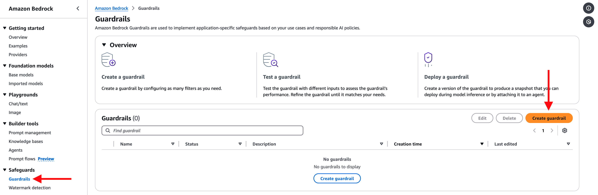
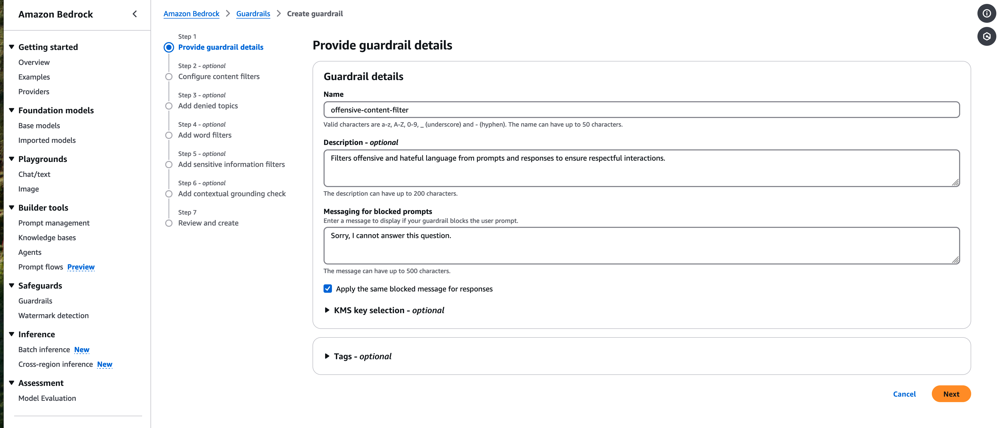
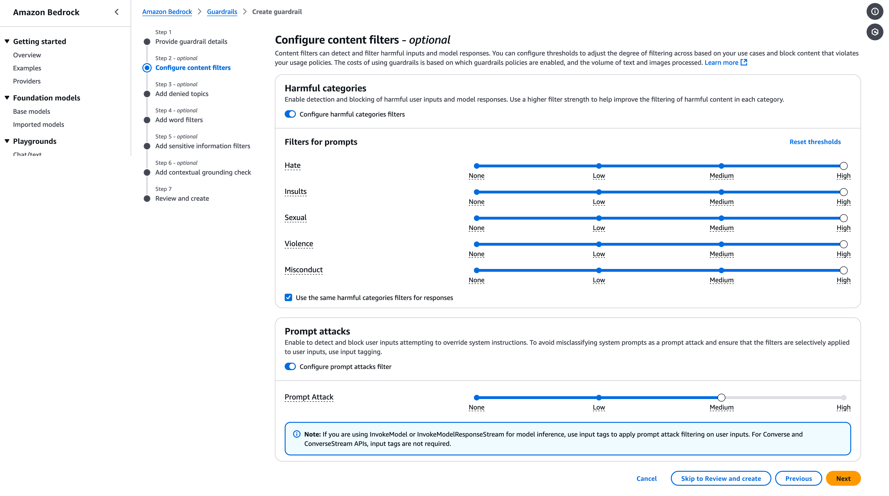
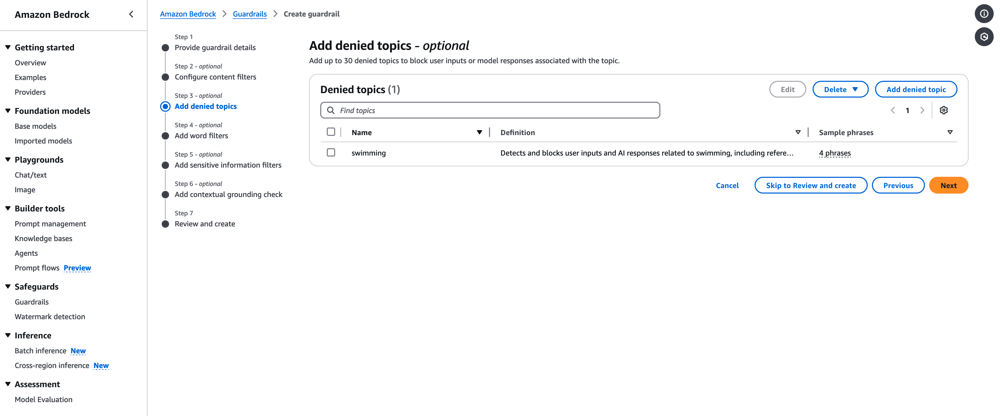
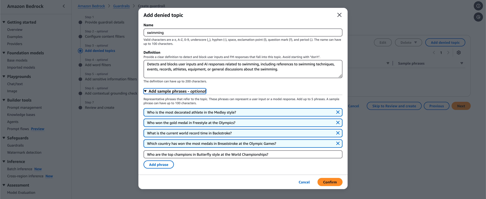
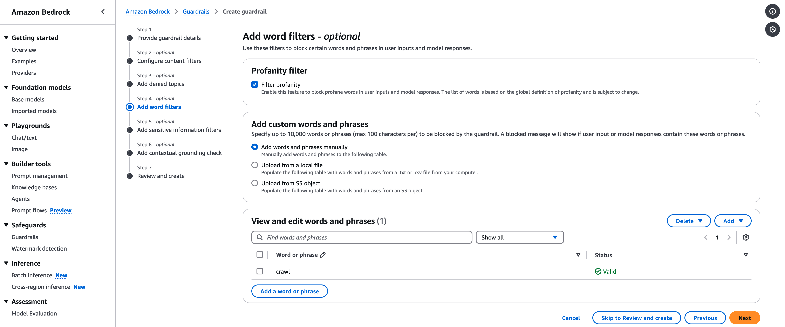
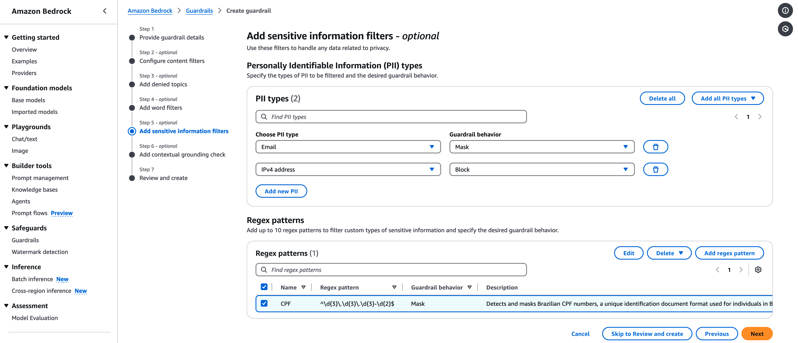
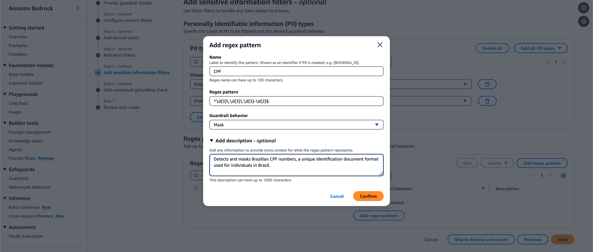
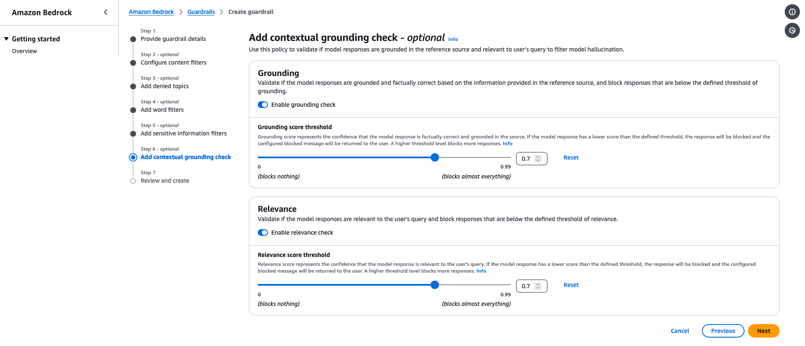

# Setting Up Guardrails on AWS Bedrock for AI Governance

## Overview
In AWS Bedrock, **Guardrails** provide a mechanism to ensure safety, governance, and security in AI-driven applications. They enable users to control and filter input prompts and output responses from foundational models to comply with organizational policies, avoid sensitive content, and protect user data. This document provides a step-by-step guide for configuring guardrails on AWS Bedrock.

---

## Step-by-Step Guide

### Step 1: Accessing Guardrails in AWS Bedrock
1. Log in to the **AWS Management Console**.
2. Navigate to **Amazon Bedrock**.
3. In the left-hand menu, locate and click on **Safeguards → Guardrails**.

---

### Step 2: Creating a New Guardrail
1. Click **Create Guardrail** to begin the configuration process.
2. Provide the following details:
   - **Guardrail Name**: e.g., `offensive-content-filter`.
   - **Description**: Add a brief explanation of the guardrail’s purpose, such as "Filters offensive and hateful language from prompts and responses to ensure respectful interactions."
   - **Messaging for blocked prompts**: Customize a message to display if your guardrail blocks the user prompt., such as "Sorry, I cannot answer this question.."

---

### Step 3: Configuring Guardrail Content
#### **3.1. Configure content filters**
- Specify what the guardrail applies to:
  - **Prompts**
  - **Responses**

#### **3.2. Adjust Filter Sensitivity**
For each type of content, adjust the sensitivity levels as needed:
- **Hate Speech**: High
- **Insults**: High
- **Sexual Content**: High
- **Violence**: High
- **Misconduct**: High
- **Prompt Attacks**: Medium (to detect attempts to manipulate the model’s behavior).

---

### Step 4: Configuring Denied Topics

1. Under **Denied Topics**, add topics you want to restrict.
2. Provide a name, e.g., `swimming`.
3. Provide a Definition, e.g. `Detects and blocks user inputs and AI responses related to swimming, including references to swimming techniques, events, records, athletes, equipment, or general discussions about the swimming.`. 
4. Add sample phrases to help the system identify undesirable prompts or responses:
  - "Who is the most decorated athlete in the Medley style?"
  - "Who won the gold medal in Freestyle at the Olympics?"
  - "What is the current world record time in Backstroke?"
  - "Which country has won the most medals in Breaststroke at the Olympic Games?"
  - "Who are the top champions in Butterfly style at the World Championships?"

---

### Step 5: Enabling Profanity Filtering

1. Toggle the **Profanity Filter** to ON.
2. (Optional) Add custom profane words:
   - Provide a file containing the words (via **S3** or manual upload).
   - Example: Ban the word `crawl` as a test.

### Step 6: Configuring Sensitive Information Filters

#### Configure PII Masking
1. Under **Personally Identifiable Information (PII)**, choose what to block or mask:
   - Email
   - IPv4 address
2. Select the behavior:
   - **Mask**: Replace sensitive data with placeholders (e.g., `[Email]`).
   - **Block**: Completely restrict the display of sensitive data (e.g., `[IPv4 address]`).

#### Configure Regex pattern
1. Under **Regex patterns**, click at "Add regex pattern":
2. Provide regex patter and descriptions:
   - **Name**:  `CPF`
   - **Regex pattern**:  `^\d{3}\.\d{3}\.\d{3}-\d{2}$`
   - **Guardrail behavior**:  `Mask`
   - **Description**:  `Detects and masks Brazilian CPF numbers, a unique identification document format used for individuals in Brazil.`

---

### Step 7: Enabling Contextual Grounding

1. Toggle the **Grounding** to ON.
2. Toggle the **Relevance** to ON.

Both **Grounding** and **Relevance** can be set to the default threshold values (0.7) for simplicity, as this is designed to be a straightforward demo.

---

### Step 8. Developing Code for Test Guardrail

With your guardrails configured, you can now interact with them programmatically using AWS SDKs, such as **Boto3 for Python**. For an example of a Python script that demonstrates querying a Guardrail, refer to the  `03_guardrails.py`  file in the repository root.