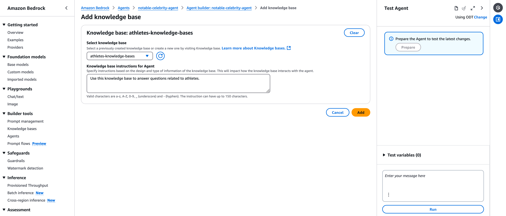

# Setting Up an AWS Bedrock Agent for AI-Powered Applications

## Overview

AWS Bedrock enables the creation and deployment of AI-powered agents by integrating foundational models, custom logic, and data sources. This guide outlines the steps to configure an agent capable of answering questions about notable individuals and retrieving real-time information using tools like **Lambda functions**, **Knowledge Bases** and **Guardrail**.

*Note: This tutorial was developed in November 2024. The AWS console, particularly for Bedrock, evolves rapidly, with frequent updates and new features. If you encounter discrepancies between this guide and the current console interface, please refer to the [official AWS documentation](https://docs.aws.amazon.com/bedrock/latest/userguide/what-is-bedrock.html) for the latest information.*

*Caution: AI services can be costly. It's crucial to document all resources created during this tutorial. After completing your tests, ensure you delete any resources to avoid unexpected charges.*

---

## Step 1: Develop a Local Python Function

**Objective:** Create a Python function that implements the desired logic for your AI model.

Begin by developing a Python function that performs the specific task you intend to incorporate into your AI model. For demonstration purposes, we'll create a function that queries Wikipedia to find links to pages about notable individuals. This example illustrates potential integration with libraries not natively available in Bedrock.

At this stage, execute the function locally to validate its behavior. Refer to the `local_function.py` file provided in the tutorial directory for the implementation.

---

## Step 2: Adapt the Function for AWS Lambda

**Objective:** Modify the Python function to be compatible with AWS Lambda.

With the core logic established, adapt your code to run within the AWS Lambda environment. This involves structuring the function to comply with Lambda's requirements. The adapted code is available in the `lambda_function.py` file in the tutorial directory. For a comprehensive understanding of integrating Lambda with Bedrock, consult the [AWS documentation](https://docs.aws.amazon.com/bedrock/latest/userguide/agents-lambda.html).

**Important Configuration Note:**  
The provided code includes an optional logging feature that exports input events (from Bedrock) and outputs (responses from Lambda) to an S3 bucket. By default, this feature is disabled (`ENABLE_LOG_EXPORT = False`). To enable it:
1. Change `ENABLE_LOG_EXPORT` to `True` in the `lambda_function.py` file.
2. Update the `BUCKET_NAME` variable with the name of an S3 bucket that you own and have write permissions for.
3. Ensure that the Lambda role has the necessary permissions to write to your specified S3 bucket (permissions will be configured in the next step).

---

## Step 3: Set Up Lambda Layer

**Objective:** Create a custom Lambda Layer to include the necessary dependencies not available in Lambda's standard runtime.

1. **Prepare the Layer Package:**
   - If you prefer to skip this step, use the pre-built `python_dependencies.zip` file provided in the tutorial directory. This file contains all required dependencies and can be uploaded directly as a layer.
   - If you want to build your own layer:
     - Detailed instructions are available in the [Managing Dependencies in AWS Lambda with Docker-Generated Layers](https://medium.com/devops-dev/managing-dependencies-in-aws-lambda-with-docker-generated-layers-78e8f08010b0) tutorial.
     - Ensure you have the `requirements.txt` and `Dockerfile` files provided in the tutorial directory.
     - Execute the following commands on your local machine to build a `.zip` file for your Lambda Layer:
        - **Build the Docker Image:**
          ```bash
          docker build -t lambda_layer .
          ```
        - **Run a Container:**
          ```bash
          docker run --name my_lambda_layer_container lambda_layer
          ```
        - **Export the Layer:**
          ```bash
          docker cp my_lambda_layer_container:/home/python_dependencies.zip .
          ```
        - **Cleanup (Optional):**
          ```bash
          docker stop my_lambda_layer_container
          docker rm my_lambda_layer_container
          docker rmi lambda_layer
          ```

2. **Upload the Layer to AWS:**
   - Navigate to the AWS Lambda console and select **Layers** from the navigation pane.
   - Click **Create layer**.
   - Provide a meaningful name (e.g., `wikipedia-layer`) and description (e.g., `A Lambda layer that includes the Python wikipedia-api library for use in functions.`).
   - Upload the `.zip` file generated earlier.
   - Specify compatible runtimes and architectures that match your Lambda function's configuration.
   - Save the layer.
  


---

## Step 4: Set Up and Configure Your AWS Lambda Function

**Objective:** Set up an AWS Lambda function and incorporate necessary dependencies via a custom layer, ensuring permissions are correctly configured for AWS Bedrock integration.

1. **Create the Lambda Function:**
   - Navigate to the AWS Lambda console.
   - Create a new function using Python 3.12 or a later version.
   - Provide a name (e.g. `bedrock-integration`).
   - Select the Runtime (e.g. `Python 3.12`).

   

2. **Configure a General configuration:**
   - Navigate to the **General configuration** tab.
   - Click the **Edit** button and update the following:
     - Set **Timeout** to **30 seconds** to accommodate potential delays in processing requests.
   - For basic functionality (e.g., no S3 logging), use the default AWS permissions.  
   - If logging interactions to S3 is needed:
     1. Create a new IAM role with basic Lambda permissions.
     2. Add an inline policy or attach a managed policy to allow write access to your S3 bucket.

   

3. **Configure a Lambda Permissions:**    
   *Note: AWS Bedrock requires Lambda resource-based policies to invoke the function.*
   - Navigate to the **Configuration** tab.
   - In the left-hand menu, select **Permissions**.
   - Under the **Resource-based policy statements** section, click **Add permissions**.
   - In the dialog, go to `AWS account` tab and configure the following:
     - **Statement ID:** `AllowBedrockInvoke` 
     - **Principal:** `bedrock.amazonaws.com`
     - **Action:** `lambda:InvokeFunction` 
   - Click **Save** to apply the policy.
   - The new policy should appear in the **Resource-based policy statements** section. Ensure it matches the following structure:
     ```json
     {
         "Version": "2012-10-17",
         "Id": "default",
         "Statement": [
            {
               "Sid": "AllowBedrockInvoke",
               "Effect": "Allow",
               "Principal": {
               "Service": "bedrock.amazonaws.com"
               },
               "Action": "lambda:InvokeFunction",
               "Resource": "arn:aws:lambda:<region>:<account-id>:function:<function-name>"
            }
         ]
      }
     ```
   
   

   

   


4. **Attach the Layer to Your Lambda Function:**
   - Open your Lambda function in the AWS Lambda console.
   - In the "Layers" section under the "Code" tab, click "Add a layer."
   - Select "Custom layers" and choose the layer you created.
   - Confirm the addition to attach the layer to your function.

   

   


5. **Deploy and test the Lambda Function:**
   - Deploy the code from `lambda_function.py` by either copying and pasting it directly into the AWS Lambda console or by setting up a deployment pipeline using your preferred Git tool.
   - Navigate to the **Test** tab.
   - Create a new test event and name it something descriptive, such as `BedrockRequestSimulation`.
   - In the **Event JSON** section, use the template provided in the `lambda_test.json` file from the tutorial directory.
   - Click the **Save** button to save the test event configuration.
   - Click the **Test** button to execute the function and verify that it operates as expected.

   

---

## Step 5: Create Bedrock Agent

**Objective:** Navigate to the AWS Bedrock console to begin agent configuration.

1. Log in to the **AWS Management Console**.
2. Navigate to **Amazon Bedrock**.
3. In the left-hand menu, click on **Agents**.
4. Click **Create Agent**.
5. Provide the following details:
   - **Agent Name**: `notable-celebrity-agent`.
   - **Description** (optional): `Agent to answer queries about notable celebrities.`

   

   

---

## Step 6: Configure Agent Details

**Objective:** Set up foundational aspects of the agent, including permissions and behavior.

1. Confirm the `Agent Name` and `Description`.
2. Select **Create Service Role** to allow AWS to generate the necessary permissions automatically.
3. Choose a foundational model, such as **Claude v3.5**.
4. In the **Instructions for the Agent** section, provide clear and concise guidelines that describe the agent's intended role and behavior. For example:
   ```
   You are a charismatic and engaging TV show host who specializes in discussing celebrity news, gossip, and entertainment updates. Your task is to deliver information in a captivating, lively, and professional manner, while maintaining a balance between humor, excitement, and respect for your audience and the celebrities you talk about. Your primary goal is to entertain and inform your audience, keeping them interested and coming back for more.

   Style and Tone:
      * Enthusiastic and Energetic: Speak with excitement and passion about the topics to create an engaging experience. Use phrases like "Can you believe it?" or "This is incredible!" to maintain a lively atmosphere.
      * Friendly and Relatable: Act as though you are having a fun conversation with the audience. Avoid overly formal language. Use simple, expressive phrases and occasional humor to connect with your viewers.
      * Professional and Respectful: While gossip and juicy stories are part of the show, avoid being offensive or overly intrusive. Always respect the privacy and dignity of the celebrities mentioned.
      * Dramatic and Storytelling: Introduce topics with a sense of drama or mystery to build intrigue. For instance, "You won’t believe who was spotted together last night!" or "Breaking news from Hollywood – this one’s a shocker!"
   ```
6. Under `Additional settings → User input` page section, enable **Clarifying Questions** to allow the agent to request additional input when needed.
7. Configure **Session Timeout** (e.g., 600 seconds).
8. Click the **Save button** on the top bar of the Agent builder console.


---

## Step 7: Configuring an Action Group

**Objective:** Define and integrate actions into the agent to enable specific functionality by linking it with a Lambda function.

1. Stay on the **Agent Builder** page (created in the previous step). Scroll to the **Action Groups** section and click the **Add** button to create a new action group.
2. Provide the following details in the **Action group details** section:
   - **Action Group Name:** `wikipedia`.
   - **Description (optional):** `Retrieve Wikipedia page links for celebrities based on user input.`
3. In the **Action group type** section, choose **Define with Function Details** to configure the action group with specific logic.
4. In the **Action group invocation** section:
   - Choose **Select an existing Lambda function**.
   - Select the Lambda function created and tested earlier in this tutorial (e.g., `bedrock-integration`).
   - Ensure the correct function version is selected (e.g., `LATEST`).
5. In the **Action Group Function Details** section, choose `JSON Editor` and input the following JSON:
```
{
  "name": "wikifinder",
  "description": "A function that searches for and returns Wikipedia links for the given celebrity.",
  "parameters": [
    {
      "name": "celebrity_name",
      "description": "Name of the celebrity whose Wikipedia link is requested.",
      "required": "True",
      "type": "String",
      "tableIndex": 0
    },
    {
      "name": "language",
      "description": "Specifies the preferred language for the Wikipedia page, using a two-letter code as defined by the ISO 639-1 standard (e.g., 'en' for English; 'es' for Spanish; 'ja' for Japanese). This parameter determines which language version of Wikipedia to query for the specified person's page. If the page exists in the chosen language, the function returns its URL; otherwise, it indicates that the page was not found.",
      "required": "False",
      "type": "String",
      "tableIndex": 1
    }
  ],
  "requireConfirmation": "DISABLED"
}
```
**Note:** 
- Double-check the JSON alignment, brackets, and syntax to avoid errors such as: 
  ```
  1 validation error detected: Value at 'functionSchema.functions.1.member.name' failed to satisfy constraint: Member must satisfy regular expression pattern: ([0-9a-zA-Z][_-]?){1,100}
  ```
6. **Save the Action Group:** Click the **Create** button to finalize the action group configuration.

**Important:**
- Ensure the parameter descriptions are clear and concise. These descriptions help the model to generate accurate inputs for the Lambda function. Proper descriptions improve the AI's ability to understand and process the required inputs effectively.


---

## Step 8: Configure Knowledge Bases

**Objective:** Attach and define usage for a knowledge base.

1. Stay on the **Agent Builder** page (created in the previous step). Scroll to the **Knowledge Bases** section and click the **Add** button to attach a knowledge base.
2. Select an existing knowledge base (e.g., one created about athletes).
3. Provide usage instructions:
   - Example: `If the user queries a person unknown to the foundation model, check this knowledge base to see if they're a athletes celebrity and get more info.`
4. Click **Save** to apply the configuration.




---

## Step 9: Configure Guardrail Details


**Objective:** Attach a Guardrail.

1. Stay on the **Agent Builder** page (created in the previous step). Scroll to the **Guardrail details** section and click the **Edit** button to attach a Guardrail.
2. Select an Guardrail .
3. Click **Save and exit** to finalize this configuration.


---
## Step 10: Create an Agent Alias

**Objective:** Create an alias for your Bedrock agent and associate it with a specific version, enabling version control and seamless deployment updates.

1. Navigate to the **Agents** page in the Amazon Bedrock console. Locate your agent in the list and click on its name to open the details page.

2. Scroll to the **Aliases** section and click the **Create alias** button.


3. Provide the following details:
   - **Alias Name**: Enter a meaningful alias name (e.g., `develop-v1`).
   - **Description** (optional): Add a description to clarify the alias purpose (e.g., `Alias for the develop-ready version of the agent.`).
   - **Associate a Version**: Select `Create a new version and associate it to this alias`. This ensures the alias points to the latest stable version of your agent.
   - **Throughput Mode**: Choose `On-demand (ODT)` for dynamic scaling based on usage or `Provisioned` if you want to predefine throughput capacity.


4. Review your configuration to ensure accuracy.

5. Click **Create alias** to finalize the setup. The alias will now point to the selected version, allowing you to use this alias in your applications for agent invocation.

**Tip:** You can update the alias to point to a different version in the future without modifying the application logic, enabling smooth rollbacks or upgrades.

---

## Step 11: Testing the Agent

**Objective:** Validate agent behavior using the AWS console.

1. Prepare the agent by clicking **Prepare**.
2. Use the testing interface to interact with the agent.
3. Validate different functionalities, such as:
   - **Foundation Model Base Query**: `Who is Michael Jordan?`
   - **Knowledge Base Query**: `Who is Alicia Torrence?`
   - **Lambda Query**:  
     - Test the query in Portuguese: `Me entregue o link da página do Wikipedia do Pelé.`  
     - Test the query in English: `Provide me with the link to Pelé's Wikipedia page.`  
     - Observe if the model automatically identifies the language of the request and provides the appropriate page.  
     - If the model cannot determine the desired language, explicitly request the page in a specific language. For example:  
       - Portuguese: `Me entregue o link da página do Wikipedia do Pelé em português.`  
       - English: `Provide me with the link to Pelé's Wikipedia page in English.`  
       - Spanish: `Dame el enlace a la página de Wikipedia de Pelé en español.`
   - **Guardrail Validation Query**: `Who is Michael Phelps?`
4. If you encounter issues with Guardrails, you can edit the guardrail configuration to observe how the response changes after the edits.


---

## Step 12: Clean Up Resources

**Objective:** Prevent unnecessary charges by removing unused resources.

1. Delete Lambda functions.
2. Remove Knowledge Bases.
3. Remove Guardrail.
4. Clear S3 buckets containing any test data.
5. Decommission any unused resources.
